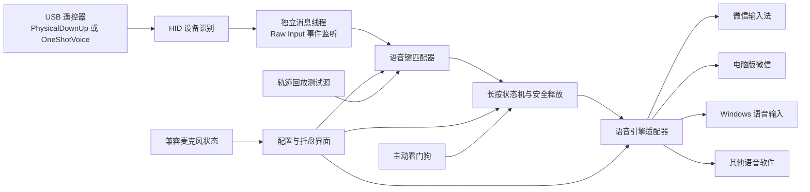

# Windows 语音遥控桥接软件方案

> 项目代号：Voice Remote Bridge（语音遥控桥）  
> 文档状态：v7，双按语音会话执行稿；严格 Release 的硬件边界仍保留  
> 编制日期：2026-08-24  
> 最近修订：2026-08-24（SH 批准“首次长按确认启动、再次按下提交”的无硬件改造方案）  
> 目标用户：SH  
> 目标平台：Windows 11 x64

## 0. 阶段 0 真机证据对方案的覆盖修订

### 0.1 当前执行决策

SH 已批准在不更换硬件的前提下实施 `VoiceCommandPressAgain`：第一次 Voice Command 脉冲后，以 `SG Control Mic` 是否进入持续非零载波确认有效长按；确认后启动语音软件。第一次实体松手不处理，说完后再次轻按语音键，第二次 Voice Command 脉冲立即停止适配器并提交。

该交互不是严格 Push-to-Talk，界面必须称为“再次按键提交”，不能显示成“松手提交”。它也不是 VAD：音频载波只负责第一次启动确认，正常结束只由第二次真实按下事件触发。详细状态机、阈值、安全边界和验收见 [`双按语音会话实施方案.md`](双按语音会话实施方案.md)。

下面的总线证据仍然有效，用于解释为什么第一次松手不能作为结束条件；BLE、替代硬件和射频逆向保留为未来恢复严格“松手提交”时的选项，不再阻塞当前双按方案开发。

### 0.2 当前硬件的严格 Release 边界

阶段 0 已证明当前 `VID_1915/PID_1025` 接收端不是 Push-to-Talk 输入源：实体按下只产生 `01CF00`，约 `29–40 ms` 后立即产生 `010000`；持续按住没有心跳，真实松开没有 Raw Input、直接 HID 或 Feature Report 事件。Feature `Report ID 0x06` 只在按下瞬间复现一次 `CF`，随后归零。

Windows USB ETW 的 `FullDataBusTrace` 又完成了总线级复核：两轮试验中，目标接收端都只在实体按下附近完成两次 3 字节中断传输；在约 4.3 秒后的实体松开时以及后续观察期，没有目标端点的 USB 中断完成。结合前述 HID 内容，可以确认这两次传输就是 `01CF00 → 010000`，不是 HIDClass 或 Raw Input 丢掉了隐藏的 Release。

USB-IF 的 HID Usage Tables 把 Consumer Page 的 `0xCF` 定义为 `Voice Command`，类型为 `OSC`（One Shot Control，一次性控制），其语义是发出一次“开始语音命令”的动作，而不是持续 Down/Up 开关。当前实测行为与这个定义一致。

`SG Control Mic` 被 `Voice Command` 激活后会持续提供底噪；实体松手没有稳定的音频状态变化。用户态软件、内核过滤驱动、USBPcap、本地 ASR 或 VAD 都不能从一个没有上报到 USB 的物理事件中恢复精确 Release。因此 v5 的 `SpeechEndpoint` 不再是推荐方向，SH 要求的“按住说话、松手立即提交”保留三条实现路线：

1. **给当前遥控器增加独立 BLE Down/Up 通道（当前首选）**：保留原 2.4 GHz 接收端和 `SG Control Mic`，只在同一个实体语音按钮上增加一个低功耗蓝牙 HID 通道。按钮按下时向 Windows 发送 Down，松手时发送 Up；原遥控器固件仍照常发送 `Voice Command` 来激活麦克风。它无需猜静音，也无需破解私有无线协议，但需要打开遥控器、测量按键电路，并在确认电气条件后进行可逆焊接或增加独立微动开关。
2. **更换输入硬件（不改遥控器）**：选择同时提供麦克风、明确按下事件和明确松开事件的遥控器/接收端。不能只看商品页写“语音遥控器”，必须在退货期内用本项目诊断工具完成总线验收；只有真实 Down/Up 通过后才进入软件适配。
3. **逆向 2.4 GHz 无线链路并制作自定义接收器/中间层（难度最高）**：绕开现有 USB 接收端，直接观察遥控器无线包中的实体按键状态，再向 Windows 暴露自定义 Down/Up HID。该路线需要额外射频硬件、协议分析和固件开发；在没有抓到无线侧 Release 前不能承诺可行。

BLE 双通道路线的数据流如下：

```text
同一个实体语音按钮
  ├─ 原遥控器电路 → 原 2.4 GHz 接收端 → 激活 SG Control Mic 并传输语音
  └─ 新增按键检测 → nRF52840 BLE → USB 蓝牙适配器或第二块 nRF52840 USB 接收端
                                                 ↓ Windows 收到真实 Down/Up
                                                 ↓
                                     Voice Remote Bridge
                                     Down：按下语音快捷键
                                     Up：释放快捷键并提交
```

Windows 原生支持 Bluetooth LE HID，nRF52840 可作为 BLE HID 键盘/按键设备。原型可用 `21 × 17.8 mm` 的 XIAO nRF52840，先接一个独立测试按钮证明 Down/Up 闭环；只有闭环通过后才评估遥控器内部空间、按键是独立开关还是矩阵扫描、供电电压和焊接方式。当前电脑未枚举到 Bluetooth 适配器，因此桌面原型还需要一个 Windows 兼容 USB 蓝牙适配器；若要避免 Windows 蓝牙配对，也可用第二块 nRF52840 作为 USB HID 接收端。量产形态可再缩成定制小板，原型板尺寸不等于最终尺寸。

当前接收端的能力标记为 `OneShotVoice/PhysicalPushToTalkUnsupported`。它不得进入精确 PTT 状态机，但允许进入已明确命名的 `VoiceCommandPressAgain` 双按状态机。

## 1. 结论

软件架构可行，但**当前接收端无法实现 SH 要求的交互**。取得真实 Down/Up 硬件后，推荐开发一个常驻系统托盘的 Windows 用户态程序；它不负责语音识别，只完成下面这条桥接链路：

```text
长按遥控器语音键
    → 精确识别兼容接收端发出的 Down/Up HID 事件
    → 调用当前选中的语音输入软件
    → 语音软件使用遥控器麦克风识别
    → 松开语音键后结束本次输入
```

首版按项目技术原则采用 **C# + .NET 10 LTS + WPF + Windows Raw Input/SendInput**。正常运行不需要管理员权限，不安装内核驱动，不录音，不上传音频，也不改变输入框焦点。

阶段 0 已把原来的硬件未知项变成明确结论：

1. **当前硬件端**：只有一次性 `Voice Command`，没有 USB Release；硬件闸门失败；
2. **兼容硬件端**：新硬件或自定义接收器必须先证明同时提供 Down、保持语义和 Release；
3. **软件端**：候选语音软件能否被可模拟的快捷键驱动，是否支持“按住开始、松开结束”，是否依赖当前输入法处于激活状态。

因此当前暂停把 `VID_1915/PID_1025` 接入主程序。先通过新增的硬件闸门，再继续完成语音软件闸门；两者都通过后才能锁定默认适配器、产品承诺和正式工期。

## 2. 已确认的本机环境

以下信息来自 2026-08-24 对当前电脑进行的只读检查。

### 2.1 系统与软件

| 项目 | 当前状态 |
|---|---|
| 操作系统 | Windows 11 家庭版，64 位，Build 22631 |
| 微信 | `4.1.12.55`，已安装 |
| 微信输入法 | `2.1.2.13`，已安装，`wetype_service` 正在运行 |
| 搜狗输入法 | `16.2.0.3184`，已安装 |
| Bluetooth | 支持服务正在运行，但当前 PnP 枚举没有发现 Bluetooth/BLE 适配器；BLE 原型需另加 USB 蓝牙适配器或自制 USB 接收端 |
| .NET | 系统仅有 .NET 8 Runtime；项目已有位于 `artifacts/.dotnet/` 的本地 .NET 10 SDK/Runtime，不需要安装全局依赖 |

2026-08-24 对本机微信输入法设置页进行了只读核对，未修改任何选项。当前 Windows 版明确显示：

- “启动语音输入”：开关式，当前快捷键显示为 `Ctrl + Win + Shift`；
- “按住说话”：界面明确写着“按住可语音输入，松手结束”，当前快捷键显示为 `Ctrl + Win`；
- 麦克风：提供独立选择项，当前为“自动检测”。

这证明评审报告中“Windows 版微信输入法是否支持语音输入、是否只能使用 Fn 均未知”的判断已经过时。但快捷键能否由 `SendInput` 稳定触发、能否安全改为不含 `Win` 的组合、是否依赖微信输入法处于当前激活状态，仍必须在阶段 0B 实测。

当前存在明确的**热键配置冲突风险**：微信输入法“按住说话”当前显示 `Ctrl+Win`，电脑版微信资料也显示默认使用 `Ctrl+Win`。这证明二者的配置可能冲突，但还不能证明两者一定同时响应；具体结果取决于当前设置、注册方式和运行状态。阶段 0B 必须分别在隔离态与共存态确认热键归属，不能在两个程序同时运行时直接判定某个适配器通过。

### 2.2 遥控器接收端

Windows 已把接收端识别为一个复合 USB 设备：

| 属性 | 已识别值 |
|---|---|
| Vendor ID | `VID_1915` |
| Product ID | `PID_1025` |
| Revision | `REV_0174` |
| 设备描述 | `SG Control Mic` |
| 音频接口 | `MI_00`，录音设备 `SG Control Mic` |
| 键盘接口 | `MI_02`，HID Usage `0x01/0x06` |
| 鼠标接口 | `MI_03/COL01`，HID Usage `0x01/0x02` |
| 消费类控制接口 | `MI_03/COL02`，HID Usage `0x0C/0x01` |
| 系统控制接口 | `MI_03/COL03`，HID Usage `0x01/0x80` |
| 厂商自定义接口 | `MI_03/COL04`，HID Usage `0xFF00/0x0000` |

这组信息说明：接收端不只是普通键盘，它还带有独立麦克风和厂商自定义 HID 通道。语音键很可能位于消费类控制、系统控制或厂商自定义通道中。Windows 没有默认动作，不等于软件读不到它。

## 3. 问题本质

Android 电视能响应语音键，是因为系统内置了“遥控器语音键 → 语音服务”的映射。Windows 虽然识别了接收端和麦克风，却没有这条映射，所以按键看起来“没有任何反应”。

本软件需要补上的不是语音识别能力，而是两层适配：

1. **硬件适配层**：认出兼容遥控器的语音键按下和松开；当前接收端只用于不兼容检测。
2. **语音软件适配层**：把这个动作转换成微信输入法、电脑版微信、Windows 语音输入或其他软件理解的快捷键/启动动作。

## 4. 产品范围

### 4.1 首版必须实现

- 后台监听指定 USB/HID 接收端，不能误响应普通键盘或鼠标。
- 对通过真实 Down/Up 验收的硬件启用“长按开始、松开结束”；对当前一次性 Voice Command 硬件只允许用户明确选择“再次按键提交”，不伪装成松手提交，也不使用语音端点猜测结束。
- 长按阈值可配置，初始建议值为 `150 ms`，最终值由兼容硬件的真机数据校准。
- 支持在系统托盘中切换语音输入软件，不需要重启程序。
- 内置以下适配模式：
  - 微信输入法；
  - 电脑版微信语音输入；
  - Windows 自带语音输入；
  - 自定义快捷键；
  - 自定义程序的开始/停止动作。
- 显示兼容接收端及其麦克风是否在线。
- 支持 USB 拔插和电脑休眠恢复。
- 发生异常、退出或设备断开时，立即释放所有模拟按键。
- 提供“学习语音键”和“测试当前语音软件”向导。
- 检查输入法型适配器要求的 TSF 输入配置是否处于激活状态；全局默认只提示，只有适配器显式启用 `InputMethodSwitch` 时才在单轮语音会话前切换并在结束后恢复。
- 使用命名 Mutex 保证单实例运行；第二个实例只唤起现有实例。
- 提供一键自检和可复制的脱敏诊断结果。
- 支持可选的开机启动，默认关闭，由用户主动开启。

### 4.2 首版不做

- 不自行进行语音识别或调用云端语音 API。
- 不录制、保存或回放语音。
- 不修改微信输入法、微信或其他软件的程序文件。
- 不默认修改 Windows 的系统默认麦克风。
- 不编写内核驱动，不注册 Windows 服务。
- 不在锁屏、登录界面、UAC 安全桌面中工作。
- 不承诺控制以管理员身份运行的目标程序。
- 不把自动切换并恢复 TSF 输入法设为全局默认；该能力已于 2026-08-25 由 SH 批准在当前微信输入法适配器上显式开启，并按 `docs/plans/双按语音会话实施方案.md` 独立验收。

## 5. 用户使用流程

### 5.1 第一次使用

1. 启动软件，程序识别候选接收端及其麦克风；当前 `VID_1915/PID_1025` 会显示“仅一次性 Voice Command，不支持松手提交”。
2. 进入“学习语音键”，按提示长按一次遥控器语音键再松开。
3. 软件记录语音键对应的 HID 报告特征，只保存按键特征，不保存音频。
4. 从阶段 0B 已验证通过的语音软件中选择一个配置。
5. 按向导在目标软件中确认语音快捷键，并选择兼容接收端的麦克风。如果建议改用安全热键，由 SH 自己在目标软件设置中修改；本软件只显示指引和检测结果，不代改第三方软件设置。
6. 只有学习器已经取得真实 Down/Up 后，才在测试框中长按语音键说一句话，松开后检查文字是否落入当前输入框。
7. 测试通过后最小化到系统托盘。

### 5.2 日常使用

以下流程只适用于已经通过 Down/Up 硬件闸门的设备：

1. 光标停在微信、Word、WPS、浏览器、记事本等输入框中。
2. 长按遥控器语音键。
3. 达到长按阈值后，目标语音软件开始听写；程序通过不抢焦点的悬浮提示或可选短提示音告知“可以开始说话”。
4. 松开按键，程序结束本次语音输入。
5. 如需更换语音软件，在托盘菜单中直接切换配置。

如果当前输入法与适配器依赖不匹配，未启用会话切换策略时显示黄色状态并拒绝启动；启用后只在麦克风载波确认成功的本轮会话中精确切换，提交或异常停止后恢复原输入法。

## 6. 总体架构



### 6.1 HID 设备识别

- 通过 `GetRawInputDeviceList`、`GetRawInputDeviceInfo` 和设备路径识别来源。
- 每种兼容设备使用经过验收的 `VID + PID + HID Collection + Report 特征` 配置，不依赖容易变化的 Windows 实例编号；`VID_1915/PID_1025` 配置只用于识别并提示不兼容。
- Raw Input 注册使用 `RIDEV_DEVNOTIFY`，通过 `WM_INPUT_DEVICE_CHANGE` 监听设备到达和移除，插回接收端后自动恢复。
- 支持以后添加第二种遥控器，不把第一款硬件参数写死在业务逻辑里。
- Raw Input 使用独立后台线程上的 `HWND_MESSAGE` message-only 窗口，不依赖 WPF 主窗口是否存在，也不让 UI 卡顿阻塞输入处理。
- 在消息线程收到 `WM_INPUT` 的第一时间使用 `Stopwatch`/QPC 记录单调时间戳，状态机和延迟指标不使用可能跳变的 `DateTime.Now`。

### 6.2 原始输入监听

优先监听当前设备暴露出的四类 HID Collection：

- 键盘：`0x01/0x06`；
- 消费类控制：`0x0C/0x01`；
- 系统控制：`0x01/0x80`；
- 厂商自定义：`0xFF00/0x0000`。

程序使用独立的隐藏消息窗口注册 Raw Input，并用 `RIDEV_INPUTSINK` 在后台接收 `WM_INPUT`。每条事件都带有来源设备句柄，因此可以区分遥控器和电脑键盘。

按 Collection 分别处理访问路径：

1. 键盘 `0x01/0x06` 和鼠标 `0x01/0x02` 会被 Windows 独占打开，事件读取以 Raw Input 为主；诊断时只能用 `CreateFile(dwDesiredAccess = 0)` 获取设备信息与报告描述符，不能假定可直接读取 Input Report；
2. 消费类 `0x0C/0x01`、系统控制 `0x01/0x80` 和厂商自定义 `0xFF00/0x0000` 若允许共享访问，可在 Raw Input 之外尝试读取 Input Report；
3. 阶段 0A 同时解析各 Collection 的 Input/Output/Feature Report 能力，但“存在 Output/Feature Report”只说明设备支持主机写入，不能在没有协议证据时断言它就是麦克风握手；
4. 只有用户态路径都失败，才评估 USB 抓包或驱动方案；这会涉及驱动安装和系统变更，必须另行评审并取得 SH 授权。

阶段 0A 必须记录语音键是否产生 Windows 原生副作用，例如搜索、助手、音量、媒体控制或开始菜单。Raw Input 能识别来源，但不能全局阻止其他程序处理事件；`WH_KEYBOARD_LL` 能吞掉键盘事件，但 `KBDLLHOOKSTRUCT` 不包含设备句柄，不能可靠区分是哪一把键盘。

因此键盘钩子不用于识别来源。只有语音键被实测映射为一个唯一且可安全全局抑制的标准键时，才允许使用钩子抑制该键，并明确它会同时影响其他键盘上的同码键。评审提出的“先由 Raw Input 识别，再在 30 ms 时间窗内由钩子精确吞掉同一设备事件”不作为既定方案：钩子必须在事件发生时立即决定是否放行，不能事后撤回，而且钩子事件本身没有设备标识，时间相关只能是启发式判断。

如果兼容候选硬件的语音键存在无法安全抑制的原生副作用，先按 0C 的全按键表评估改用其他无副作用按键。该分支只有在麦克风音频不依赖原语音键时才成立；否则换键或本地 ASR 都不能单独解决问题。

### 6.3 语音键学习器

学习器不要求提前知道语音键代码，而是比较“未按键 → 按下 → 持续按住 → 松开”四个阶段的 HID 报告，生成匹配规则：

- 设备标识；
- HID Collection；
- Report ID；
- 发生变化的字节偏移；
- 按下值、松开值和可忽略位掩码；
- 是否存在重复报告或心跳；
- 是否存在明确的 Key Up/Release。
- 按键期间是否产生系统可见副作用；
- 按键期间候选设备麦克风是否出现有效音频电平；
- 各 Collection 的 Input/Output/Feature Report 能力。

0C 不只采集语音键，还要逐一枚举候选遥控器上所有可用按键，形成“按键 → Collection/Report → Windows 原生副作用”的候选表，为语音键不可用时保留换键路径。候选表增加可选的“与语音键物理相邻/容易误碰”人工标记；HID 报告本身不能推断塑料外壳上的物理位置，因此该列由 SH 对照实物确认，不能伪装成自动识别结果。采集范围只限候选遥控器，不采集电脑普通键盘内容。

音频通道要分三种状态测试：不按任何键、按住语音键、按住其他候选键。分别记录候选麦克风是否出现有效电平，以判断音频是否与语音键固件绑定。

如果没有明确松开事件，界面必须明确提示“该硬件不支持按住说、松手提交”。当前硬件可以由 SH 明确选择“首次长按确认启动、再次按键提交”；不能自动切换，也不能用静音检测或超时推断冒充松手提交。

`HidProbe` 同时把诊断事件输出为结构化 JSON：单调时间戳、设备标识、Collection、Report ID 和原始字节。原始轨迹只能进入 `artifacts/`，不进常规日志、不提交。只有确认轨迹仅包含语音键报告并完成脱敏审查后，才能转为 `tests/fixtures/hid/` 的回放夹具。

### 6.4 长按状态机

```text
Idle（仅在已经观察到按键处于中性/松开状态后允许进入）
  └─ 收到语音键按下 → Candidate

Candidate
  ├─ 记录 FocusSnapshot：前台窗口 + 可取得时的前台线程焦点控件
  ├─ 立即用缓存状态预检目标进程、输入法依赖和麦克风
  ├─ 未到阈值就松开 → Idle，不触发
  ├─ 达到阈值前焦点快照已变化或无法可靠复核 → Latched，中止并提示
  └─ 达到 150 ms、预检通过且焦点未变化 → Speaking，调用 Start

Speaking
  ├─ 收到松开 → 调用 Stop → Stopping(rearm=Idle)
  ├─ 接收端断开/电脑休眠/程序退出 → EmergencyStop → Stopping(rearm=Latched)
  ├─ 看门狗发现会话变化、目标进程退出或注入状态异常 → EmergencyStop → Stopping(rearm=Latched)
  ├─ 若阶段 0A 证明按住期间有心跳，心跳超时 → EmergencyStop → Stopping(rearm=Latched)
  └─ 达到安全上限 → 强制 Stop → Stopping(rearm=Latched)

Stopping
  ├─ 适配器确认结束且冷却完成 → 按 rearm 目标进入 Idle 或 Latched
  ├─ 收到新的按下/重复报告 → 忽略，不排队
  └─ 会话变化或停止超时 → EmergencyStop → Latched

Latched（本轮已结束，但尚未确认物理键回到中性）
  ├─ 收到按下/重复报告 → 保持 Latched，不触发
  ├─ 收到明确 Release/中性报告 → 冷却完成后 Idle
  ├─ 设备断开 → 保持锁存；重连后必须先观察中性报告才重新武装
  └─ 仅当 0A 证明报告/心跳语义可靠时，才允许用经验证的静默超时解除
```

预检不得在 `Candidate` 中执行慢速阻塞操作。进程、TSF 配置和麦克风状态由后台持续维护缓存，按下时只读取缓存并做必要的轻量刷新，避免把首字延迟转移到预检阶段。焦点快照使用 `GetForegroundWindow()`，并在可取得时用 `GetGUIThreadInfo()` 记录前台线程的 `hwndFocus`；若前台窗口或有效焦点控件在阈值期间发生变化，默认中止。该检查只能发现窗口/控件变化，不能可靠证明同一编辑控件内的插入点没有移动。

`Latched` 是重新武装门槛，不是用超时猜测 Release。程序启动、设备重连以及任何“键可能仍被按住”的异常恢复后，都必须先观察阶段 0A 已定义的中性状态；若硬件没有可靠 Release/中性语义，则 `PushToTalk` 本身不放行，不能用一个任意静默期绕过。

程序另设 1 秒周期的主动看门狗。它只使用已经过阶段 0A 证明可靠的信号，避免把“某些设备没有心跳”误判为故障。看门狗检查当前登录会话、目标进程、自己注入的修饰键状态和安全时限；发现不一致立即执行 `EmergencyStop`。

默认参数：

| 参数 | 默认值 | 作用 |
|---|---:|---|
| 长按阈值 | `150 ms` | 专用语音键兼顾防误触和首字延迟；真机后校准 |
| 去抖时间 | `50 ms` | 合并抖动和重复报告 |
| 单次最长时间 | 安全热键 `120 s`；含 `Win` 的热键 `60 s` | 减少危险修饰键长时间保持 |
| 最小重触发间隔 | `300 ms` | 给目标语音软件完成停止与文字落屏的时间；按适配器实测调整 |
| 重新武装条件 | 明确 Release/中性报告 | 安全上限或异常停止后禁止被重复报告立即触发下一轮；静默超时仅在 0A 证明可靠时启用 |
| 断连释放时限 | `< 1 s` | 避免 Ctrl/Win 等修饰键卡住 |

### 6.5 语音引擎适配器

主程序只理解四个动作：`Probe`、`Start`、`Stop`、`EmergencyStop`。每种语音软件实现自己的适配器。默认适配器与实现顺序不在阶段 0B 前锁定。

阶段 0B 使用物理键盘和一个最小 `SendInput` 探针，对每个候选适配器生成实测矩阵。该探针属于阶段 0 的开发资产，必须在 SH 批准进入阶段 0 后才能创建和运行。

矩阵测试前先做“热键归属确认”：

1. 仅运行微信输入法相关进程时测试；
2. 仅运行电脑版微信时测试；
3. 两者同时运行时测试真实部署行为；
4. 每种状态记录实际弹出的语音界面、文字落屏来源、焦点变化和是否重复输入。

关闭应用、停止相关进程或修改第三方软件快捷键都会改变用户当前软件状态，执行阶段 0B 时必须由 SH 明确同意；优先由 SH 手动关闭或修改，本项目工具不擅自终止进程或改写设置。隔离态结果用于判断单个适配器能力，共存态结果只用于确定部署约束，不能互相替代。

| 适配器 | 当前已知事实 | 阶段 0B 必测项 | 阶段 0 前结论 |
|---|---|---|---|
| 微信输入法 2.1.2.13 | 本机设置页存在 Toggle 和“按住说话”；当前分别显示 `Ctrl+Win+Shift`、`Ctrl+Win`；麦克风可选 | `SendInput` 是否生效、热键能否改为安全组合、微信输入法未激活时是否响应、微信外输入框、释放语义 | **首选候选，但未放行** |
| 电脑版微信 4.1.12.55 | 已有资料表明支持按住 `Ctrl+Win` 并可在微信外输入 | 当前版本实测、热键是否可改、开始菜单/Win 组合副作用、目标进程退出行为 | **候选，未放行** |
| Windows 自带语音输入 | 官方快捷键为 `Win+H`，属于开关式 | 启动/停止闭环、焦点保持、语言与网络依赖 | **只按 Toggle 设计** |
| 其他软件 | 未知 | 快捷键、触发模型、进程依赖、输入法依赖、注入方式、麦克风选择 | **逐个建档** |

矩阵还必须记录：语音功能是否存在、快捷键是否可配置、是否有可见“正在听”反馈、是否要求特定 TSF 输入法激活、在记事本/Word/浏览器是否生效，以及 VK/ScanCode 哪种注入方式成功。

适配器配置增加：`ConflictingListeners`、`RequiresStoppedProcesses`、`ForbiddenModifiers`、`ValidatedInjectionMode`、`InjectionLifetime` 和 `GuardPolicy`。其中 `InjectionLifetime` 区分 `HeldAcrossSpeech`、`AtomicBatch` 与 `StartStopStateful`，0B 据此决定是否必须启用 `InputGuard`。`Probe` 与一键自检检查已知冲突进程和禁止修饰键；但 Windows 没有通用 API 可以枚举“所有注册了某热键的第三方监听者”，因此这里只能检查阶段 0B 已确认的冲突方，不能承诺发现所有未知监听者。

`Probe` 可把短暂调用 `RegisterHotKey` 后立即 `UnregisterHotKey` 作为补充冲突信号：注册失败可能表示组合已被其他 `RegisterHotKey` 调用占用，也可能是系统保留组合或其他调用条件不满足，必须同时记录 `GetLastError`，不能直接判定“某个指定软件占用”；注册成功也不能证明没有低级键盘钩子、Raw Input 或目标软件私有监听。该探测只在 0B 诊断时执行，不在常驻运行中抢占目标热键。

阶段 0B 矩阵以带 schema 版本的结构化 JSON 保存。只有验证通过的行才能生成首版内置 `adapters.generated.json`，避免把人工文档再次誊抄成代码预设。测试证据与生产预设分开：矩阵保留环境、版本和结果，生成文件只保留运行所需字段。

必须同时支持四种触发模型：

- `PushToTalk`：按住期间保持快捷键，松开释放；
- `Toggle`：第一次动作开始，第二次动作结束；
- `TapOnHold`：长按阈值到达时点按一次，松开不做动作；
- `StartStopPair`：开始和停止使用两组不同快捷键或程序动作。

这层抽象是实现“以后装其他语音输入软件，也能在本软件里选择”的关键。

### 6.6 快捷键注入

- 使用 Windows `SendInput` 发送标准键盘按下与松开事件。
- `Start` 前用 `GetAsyncKeyState` 和本程序维护的真实设备状态快照检查 Ctrl、Win、Shift、Alt，但不再一刀切要求所有修饰键都松开。仅在两种情况下拒绝启动：①物理按住的修饰键属于本轮准备注入并在结束时释放的组合，避免借用并错误释放用户的物理键；②物理按住的额外修饰键会把本轮组合扩展成 `ForbiddenModifiers` 记录的已知冲突组合。
- `ForbiddenModifiers` 按适配器精确配置。例如 `Ctrl+Win` 若已确认 `Ctrl+Win+Shift` 是冲突组合，则记录 `Shift`；单键 `F13`–`F24` 默认可为空，只有 0B 确认 `Shift+F13` 等超集存在冲突时才增加。未知监听者仍不能靠该字段自动发现。
- 启动后只对本轮登记的注入按键发送 Key Up。已知限制：如果用户在 `Speaking` 期间物理按下同一个修饰键，Windows 用户态看到的是合并后的全局键状态，无法可靠区分两个来源；结束时的 Key Up 可能同时清除用户的物理修饰键状态。
- 适配器可在 `VK` 与 `ScanCode` 两种注入模式中选择，默认 `VK`。诊断页可以逐种测试，但不提供“同时两种都发”，因为重复注入可能把 Toggle 适配器立即打开又关闭。
- 首选配置路径是让目标软件使用不含常用修饰键的安全热键；优先尝试单键 `F13`–`F24`，但只有目标软件热键录入器实测接受、且 SH 自己完成设置修改后才能采用。
- 对必须使用 `Ctrl+Win` 的配置，按下顺序、释放顺序、开始菜单行为和用户同时操作键盘的风险由阶段 0B 决定；不得凭推测写死“反序释放”。
- 不使用废弃的 `keybd_event`。
- 软件退出、崩溃恢复、设备断开和会话切换都走统一的 `EmergencyStop`。
- 受 Windows UIPI 限制，普通权限程序不能向更高权限程序可靠注入按键，因此首版明确只支持普通权限输入框。

### 6.7 麦克风处理

当前不兼容接收端提供 `SG Control Mic`；替代硬件也必须提供可被目标语音软件使用的录音端点。统一策略是：

1. 本软件只检测并显示该麦克风是否在线、是否被禁用、是否有输入电平；
2. 在微信输入法或目标语音软件的设置中，把通过 0C 的录音端点选为该软件的麦克风；
3. 本软件不默认改变 Windows 全局默认麦克风，避免影响会议、通话和录音软件；
4. 如果某个语音软件只能使用系统默认麦克风，后续可增加“启动前临时切换、结束后恢复”的可选功能，但必须单独验证并由用户显式开启。

本软件不读取、缓存或转发真实音频内容。电平测试只显示瞬时数值，不保存音频。

0C 把“按住语音键期间候选录音端点出现有效音频电平”作为硬件闸门，而不是普通风险项。如果没有电平，则该候选设备不放行；在协议未知时不盲目向设备写报告。

### 6.8 输入法依赖检查

适配器配置增加可空字段 `RequiresActiveIme`。为空表示与当前输入法无关；非空时，`Probe` 必须验证目标 TSF 输入配置是否激活。

- `GetKeyboardLayout()` 只作为传统 HKL 线索，不能单独判断现代 TSF 输入法；
- 优先使用 `ITfInputProcessorProfileMgr::GetActiveProfile` 或 `ITfInputProcessorProfiles::GetActiveLanguageProfile` 获取活动文本服务；
- 不匹配时默认“提示并不启动”，避免静默失败；适配器显式启用时才允许自动切换；
- “自动切换并在结束后恢复”必须用 TSF Profile API 实现并单独验收，不能只调用 `ActivateKeyboardLayout`；当前微信输入法适配器已获 SH 批准实施，2026-08-25 已通过交互桌面的 WeType 启用、精确激活、活动 Profile 确认和原微软拼音恢复闭环，详细失败回滚与恢复顺序见双按方案 0.3 节。

### 6.9 运行隔离与单实例

`InputGuard` 是否进入首个可交付版本由阶段 0B 的**注入生命周期**决定，而不是只看热键是否包含 `Win`：

- `PushToTalk/HeldAcrossSpeech` 在整段说话期间保持 Key Down，必须使用 `InputGuard`，即使按键是 `F13`–`F24`。这类单键卡住虽然通常不会触发系统快捷键，但可能让目标软件持续监听麦克风，也违反“注入按键必须成对释放”的项目硬规则；
- `Toggle/TapOnHold` 若 0B 证明每次动作都能在一次 `SendInput` 批次内成对完成 Key Down/Key Up，可由主进程直接执行原子式短动作，`InputGuard` 可降为可选；但它不能解决目标软件自身的 Toggle 状态不确定性；
- `StartStopPair/StartStopStateful` 只有在 0B 证明 Stop 动作可重复、可安全补发时，才允许守护进程在租约失效后执行停止动作；否则必须把“主进程崩溃后目标软件可能继续听写”列为适配器残余风险，不能假装通过 Key Up 已解决。

- 命名 Mutex 保证当前用户会话只运行一个实例；
- 第二个实例启动时通过本地进程间通信唤起现有设置窗口，然后退出，不再注册 Raw Input 或注入快捷键；
- Raw Input 消息线程、核心状态机和 WPF UI 线程相互隔离；UI 只订阅状态快照，不直接处理 HID 事件；
- 对 `GuardPolicy=Required` 的适配器，`InputGuard` 是唯一的正常注入方：主程序通过本地命名管道发送带单调递增 `epoch` 的 `Hold(keys)`、`Release(epoch)` 和租约续期消息，所有正常 `SendInput` 均由 `InputGuard` 执行；旧 epoch 消息直接丢弃，IPC 操作必须幂等；
- `InputGuard` 同样使用命名 Mutex 保证当前用户会话只有一个实例。主程序持有守护进程句柄：若守护进程退出，主程序立即用仅限 Key Up 的本地兜底路径释放当前登记键并停止新一轮触发；
- `InputGuard` 持有主进程句柄并监控租约：主进程句柄已 signaled 时立即释放；只是心跳迟到时先进入 3 秒宽限期并告警，宽限期仍未恢复则安全优先释放，避免主进程死锁时无限卡键。该策略可能截断当前听写，属于有意的安全取舍；
- 守护进程重启采用指数退避，初始建议 `1/2/4/8/16 s`，连续 5 次启动失败后停止自动重试并进入红色状态；稳定运行 60 s 后才清零失败计数。只有 `AtomicBatch` 且 0B 已验证安全的适配器可以降级为主进程直接短动作；`HeldAcrossSpeech` 禁止绕过守护进程继续注入；
- 主程序与 `InputGuard` 在同一瞬间都被强制终止时，没有仍存活的用户态进程可以补发 Key Up。这是双进程方案的已知残余风险；下次启动先进入未武装状态并提示执行安全释放/中性检查。若要求在这种极端情况下也实时保证释放，只能另评估更高隔离级别的服务或驱动，并需 SH 单独批准；
- `InputGuard` 不是 Windows 服务，不提升权限，也不读取 HID、音频或文本。命名管道往返计入内部处理延迟指标；
- `Core` 只依赖 `IHidEventSource`、`IKeyInjector`、`IAudioDeviceMonitor`、`IInputProfileProbe` 和 `IClock` 等端口接口，Windows API 实现在 `Windows` 层。

## 7. 界面方案

### 7.1 系统托盘

- 绿色：遥控器和所选语音软件均可用；
- 黄色：遥控器在线，但语音软件、麦克风或所需输入法未就绪；
- 灰色：接收端未连接；
- 红色：检测到按键卡住、适配器错误或权限限制；
- 右键菜单：当前语音软件、切换配置、测试、紧急停止、设置、退出。

“紧急停止”必须始终可用，用于释放全部模拟修饰键并结束当前适配器状态。

开始收音反馈不能只依赖屏幕角落的托盘图标。首版提供可选短提示音；如果启用悬浮指示，窗口必须使用 `WS_EX_NOACTIVATE`，不得抢走输入焦点。启用悬浮指示后才需要把多显示器与 DPI 变化纳入相应 UI 验收。

### 7.2 设置页

建议分为四页：

1. **设备**：显示 VID/PID、接口、连接状态、关联麦克风、Down/Up 能力和重新学习语音键。
2. **语音软件**：新增、编辑、复制和切换适配器配置；检测目标进程是否运行。
3. **触发方式**：长按阈值、触发模型、最长时限、短按行为。
4. **诊断**：最近事件、适配器调用结果、按键是否完整释放、VK/ScanCode 分步测试、导出脱敏日志和一键自检。

默认短按行为为“不执行任何操作”。后续可以让用户把短按映射为打开语音软件，但不进入首版核心范围。

一键自检按链路输出：接收端在线 → Raw Input 注册有效 → 已验证 Down/Up 规则存在 → 关联麦克风在线且未静音 → 目标进程运行 → TSF 输入法依赖匹配 → 已知热键冲突方不存在或已改键 → `RegisterHotKey` 补充探测结果及局限 → 快捷键配置有效 → 所需 InputGuard 状态正常 → 上次注入已完整释放。结果可复制，但必须脱敏，不包含原始普通键盘事件、音频或转写内容。

自检页固定说明：“本软件只能验证遥控器到快捷键注入这一段。识别质量、联网状态、账号状态和云服务可用性由目标语音软件负责；如果本页全部为绿色但没有文字上屏，请检查目标软件的网络、账号和服务状态。”不能把第三方识别失败误报成本软件已检测通过的完整链路。

## 8. 技术选型

| 层次 | 选择 | 理由 |
|---|---|---|
| 语言与运行时 | C# / .NET 10 LTS | 服从当前项目 `AGENTS.md` 技术原则；使用工作区内本地 SDK，不安装全局依赖 |
| 桌面 UI | WPF | 适合托盘和传统 Windows 桌面设置界面；不承担 Raw Input 消息泵 |
| 硬件输入 | Win32 Raw Input + HID API | 能在后台收事件并区分具体来源设备 |
| 动作输出 | Win32 `SendInput` | 可表达 Key Down/Key Up，适合 Push-to-Talk |
| 音频状态 | Windows Core Audio / MMDevice | 枚举兼容设备关联的录音端点，监测在线状态和电平 |
| 配置 | 带 `schemaVersion` 的本地 JSON | 易迁移、可备份、无需数据库，并为配置升级预留迁移入口 |
| 日志 | 本地滚动文本日志 | 只记录状态和错误，不记录音频或转写文字 |
| 首次交付 | 自包含 x64 便携版 | 先完成硬件验证，不要求用户安装 .NET 运行时 |
| 正式交付 | 个人使用可由源码本地构建；对外分发使用签名安装包 | 发布范围决定是否采购代码签名证书 |

不选 Windows 服务的原因：HID 输入、托盘界面和快捷键注入都属于当前登录用户的交互桌面；服务会引入会话隔离和权限复杂度，却不能解决核心问题。

当前电脑尚未发现 .NET SDK。安装 SDK 属于系统级软件安装，必须在 SH 批准开发并单独授权后执行。

## 9. 计划中的代码结构

```text
src/
  VoiceRemoteBridge.App/          # WPF、托盘、设置界面
  VoiceRemoteBridge.Core/         # 状态机、配置、适配器抽象
  VoiceRemoteBridge.Windows/      # 端口实现：Raw Input、HID、SendInput、Core Audio、TSF
  VoiceRemoteBridge.InputGuard/   # 持续按键适配器的守护注入方；epoch/租约/异常释放
tests/
  VoiceRemoteBridge.Core.Tests/   # 状态机和配置单元测试
  VoiceRemoteBridge.Windows.Tests/# Windows API 集成测试
  fixtures/hid/                   # 经审查脱敏后的 HID 轨迹回放夹具
tools/
  HidProbe/                       # 阶段 0A 硬件诊断与轨迹输出
  InputInjectionProbe/            # 阶段 0B 最小快捷键注入探针
docs/
  plans/                          # 方案与决策记录
artifacts/                        # 本地构建和诊断输出，不提交
```

依赖方向固定为：`App → Core ← Windows`。`Core` 不引用 WPF、Win32 或具体输入法；`Windows` 实现端口，`App` 只负责组装。测试中的 `TraceReplaySource` 实现 `IHidEventSource`，把阶段 0A 生成的脱敏真实轨迹作为种子，再通过属性/变异测试生成不同输入序列，不依赖真实硬件。

变异维度至少包括：阈值和去抖边界的时间抖动、按下/中间/松开报告缺失、重复与时间戳异常、其他设备事件穿插、Idle/Candidate/Speaking/Stopping/Latched 状态下的设备移除与会话变化、Candidate 期间前台窗口变化，以及上一轮尚在 Stopping/Latched 时的连击。测试使用假的 `IKeyInjector` 跟踪逻辑按键集合；核心不变量是“所有终止/安全停止路径结束后，本程序持有的注入按键集合为空”。若序列末尾仍未确认物理键中性，停在 Latched 是正确结果；追加明确 Release/中性事件后必须回到 Idle，且重复按下报告不得让 Latched 进入 Candidate。同一条轨迹机械重复不计作额外覆盖。

## 10. 开发阶段与交付物

| 阶段 | 工作内容 | 预计工作量 | 前置依赖与不确定度 | 阶段出口 |
|---|---|---:|---|---|
| 0A. 当前硬件闸门 | 已完成 HID、Feature、WASAPI 与 USB ETW 检查 | 已完成 | `VID_1915/PID_1025` 只提供 One Shot `Voice Command` | **未通过**：总线上没有实体 Release；形成明确阻塞证据 |
| 0D. 双按语音会话 | 实现 One Shot neutral 忽略、首次音频载波确认、再次 Pressed 提交、探针交接和异常清理 | 1–2 天 | 依赖当前 `SG Control Mic` 载波特征和目标适配器 | 自动化通过；进入短按、长按、再次按键、拔插与真实文字上屏验收 |
| 0C. 真实 Release 来源 | C1：BLE 独立测试按钮闭环；C2：只读测量当前遥控器按键拓扑与空间；C3：经批准后做可逆 BLE 按键接入。若不改遥控器，则筛选替代硬件；最后才考虑 2.4 GHz 逆向 | BLE 桌面原型预计 0.5–1 天；遥控器电气评估和装配需看实物；替代硬件另加采购时间；RF 逆向暂不估时 | BLE 路线依赖 Windows 蓝牙、内部空间、按键拓扑和安全供电；替代硬件依赖候选实物；RF 路线可能受调制、配对或加密阻塞 | 连续 20 轮都取得唯一 Down、保持/状态语义和唯一 Release；原通道麦克风同时可用 |
| 0B. 语音软件闸门 | 用物理键盘与最小注入探针测试微信输入法、电脑版微信、Windows 语音输入；当前双按方案优先验证 `Ctrl+Win` HeldAcrossSpeech 与 `Ctrl+Win+Shift` Toggle | 0.5–1 天 | 适配器行为可能随版本变化 | 至少一个适配器完成开始、再次按键结束、微信外上屏和异常停止闭环；生成验证预设 |
| 1. 最小可用版本 | 独立 Raw Input 线程、双按/物理 PTT 状态机、首个通过 0B 的适配器、按 `GuardPolicy` 选择守护注入或原子短动作、单实例和基础托盘 | 2–3 天 | 当前双按路线依赖 0D+0B；若首个适配器为 `HeldAcrossSpeech`，InputGuard IPC 和故障切换仍是阶段 1 前置项 | 在记事本、微信和浏览器中连续完成首次长按开始、再次按键提交；异常后无模拟键持续按下 |
| 2. 多语音软件 | 适配器配置、TSF 依赖检查、VK/ScanCode、Toggle/StartStopPair、配置切换 | 1–2 天 | 每个适配器单独验收，中不确定度 | 不重启即可切换两个已验证适配器和一个自定义配置 |
| 3. 稳定性与诊断 | 看门狗、拔插、休眠、锁屏/用户切换、异常退出、变异轨迹测试、一键自检、8 小时运行测试 | 2–3 天 | 依赖真实硬件循环和系统场景测试；若 0B 要求 InputGuard，epoch、租约、重启退避和双向故障注入是最大单项不确定度 | 达到自动化和真机验收指标，无模拟按键卡住或系统快捷键副作用 |
| 4. 交付包装 | 自包含便携包、源码、使用说明；按发布范围决定签名安装包 | 0.5–1 天，不含证书等待 | 代码签名仅在对外分发时成为前置项，证书获取可能是周级等待 | 在目标电脑从零配置并通过验收 |

软件部分原粗估不再作为当前总工期，因为真实 Release 来源尚未选定。路线 A 取得兼容硬件后可重新估算；路线 B 是独立硬件/固件项目，不能套用原来的软件天数。个人本机验证不立即申请代码签名证书；如果 SH 以后决定把软件分发给其他人，再单独评估证书采购、签名和安全软件误报申诉，公开发布仍需另行授权。

## 11. 验收标准

### 11.1 功能验收

严格 PTT 验收仅适用于已经通过 0C 的硬件；当前 `VID_1915/PID_1025` 不得标为严格 PTT 兼容。当前硬件按双按方案另行验收：短按不启动、长按载波确认后启动、第一次 neutral 不停止、下一次 Pressed 提交。

- 软件能唯一识别 0C 选定的兼容设备，不把普通键盘快捷键误判为遥控器语音键；连接 `VID_1915/PID_1025` 时明确显示不兼容且不触发。
- 短按小于阈值时不启动语音输入。
- 长按达到阈值后启动所选语音软件，松开后结束。
- 本软件自身不改变前台窗口或输入焦点；Candidate 期间检测到前台窗口或可识别的焦点控件变化时，中止本轮而不是向新目标注入。该保证不覆盖“同一编辑控件内的插入点移动”。
- 焦点未变化时，识别结果由目标语音软件写入原输入框。
- 托盘切换语音软件后立即生效，不需要退出或重启。
- 第二次启动程序时不得重复注册或重复注入，只唤起已有实例。
- 接收端拔出再插入后自动恢复。
- 电脑休眠再唤醒后自动恢复。
- 未安装、未运行目标语音软件或所需 TSF 输入法未激活时给出清晰提示，不静默失败。
- 一键自检能定位链路中未就绪的具体环节，并输出脱敏结果。

### 11.2 可靠性验收

- 以脱敏真实轨迹为种子生成至少 1000 个不同的变异序列；所有终止/安全停止路径后逻辑注入按键集合必须为空；未确认物理中性时允许停在 Latched，但追加明确 Release/中性事件后必须回到 Idle，且重复按下报告不得重新触发。失败为 0，同一序列重复运行不计作不同覆盖。
- 使用真实遥控器连续执行 100 次长按/松开，至少 99 次正常开始和结束。
- 真机 100 次循环中不得出现 Ctrl、Win、Shift、Alt 卡住，不得意外打开开始菜单，也不得触发任何非预期 `Win` 组合动作。
- 设备断开、程序退出或达到安全时限后，1 秒内执行安全释放。
- 分开记录两个延迟指标，诊断页显示 P50/P95/最大值：
  - **总触发延迟**：首个语音键按下 `WM_INPUT` 时间戳 → 实际注入方的 `SendInput` 返回。P95 目标为 `≤ 当前配置长按阈值 + 50 ms`，因此阈值经 0A 校准后指标会同步变化；
  - **内部处理延迟**：长按阈值到期时间戳 → 实际注入方的 `SendInput` 返回；启用 InputGuard 时包含命名管道 IPC，P95 目标 `≤ 30 ms`、最大值 `≤ 100 ms`。
  
  语音软件启动、网络识别和文字落屏耗时不计入上述桥接指标。第二轮评审建议把原“WM_INPUT → SendInput”整体直接收紧为 30 ms，但该区间包含有意设置且会在 0A 校准的长按阈值，无法同时成立，因此采用“相对阈值的总延迟 + 固定内部延迟”双指标。
- 连续运行 8 小时后无持续增长的句柄或内存泄漏，程序仍能完成一次正常开始/结束。
- 锁屏、解锁、快速用户切换和目标进程异常退出后，程序能安全停止并在条件恢复后重新就绪。

### 11.3 隐私与安全验收

- 配置和日志中不出现音频、转写文本、密码、token 或聊天内容。
- 默认不修改系统默认麦克风、输入法和全局快捷键设置。
- 自定义程序动作不经过 `cmd.exe` 或 PowerShell 拼接执行。
- 普通用户权限可完成日常运行。

### 11.4 项目规则与真机用例对照

| `AGENTS.md` 要求 | 对应用例 |
|---|---|
| 短按 | 小于阈值不触发，连续 20 次无误启动 |
| 长按 | 1 s、10 s 和配置上限三档测试 |
| 松开 | 正常松开、快速松开、松开报告缺失模拟 |
| 重复触发 | 连击、Stopping/Latched 期间再次按下、冷却期内再次按下、按键自动重复报告；持续按住直到安全上限后不得自动开始第二轮 |
| 接收端拔插 | Idle、Candidate、Speaking、Stopping、Latched 五个状态下分别拔插；重连后未观察到中性状态前不得触发 |
| 休眠恢复 | Idle、Speaking、Stopping、Latched 状态下进入休眠并恢复 |
| 程序异常退出 | 对 `GuardPolicy=Required` 的适配器：Speaking 中分别强制终止主程序和 `InputGuard`，验证存活方在 1 秒内释放、拒绝新触发及按退避规则重启；同时终止两进程作为残余风险演练，记录下次启动的未武装与恢复提示 |
| 不同输入框 | 记事本、微信、浏览器，以及阶段 0B 选定的办公软件；Candidate 期间切换前台窗口/焦点控件必须中止本轮，同一控件内移动插入点记录为能力边界 |

全屏独占应用不是首版目标场景，不作为放行指标。只有启用悬浮反馈时，才增加多显示器、DPI 变化和全屏覆盖行为的 UI 验收。

## 12. 风险与对策

| 风险 | 影响 | 对策 |
|---|---|---|
| 语音键走厂商自定义 HID，Raw Input 未收到 | 无法直接识别按键 | 阶段 0A 按 Collection 检查 Raw Input 与共享 HID Input Report；独占键鼠 Collection 不假定可直接读取 |
| 遥控器只发一次性 Voice Command，不发实体松手 | 无法严格实现按住说、松开停 | 标记 `PushToTalkUnsupported` 并阻止启用；更换经过 Down/Up 验收的硬件，或另立射频逆向项目；不自动降级为 Toggle/VAD |
| 遥控器麦克风需要未知主机握手 | 语音软件启动但收不到声音 | 作为阶段 0A 闸门；测电平并解析 Output/Feature 能力，在协议未知时不写设备 |
| 语音键产生 Windows 原生副作用 | 搜索/助手等抢焦点 | 阶段 0A 必测；仅唯一键码可条件使用全局钩子；严格按设备抑制需要另评估过滤驱动 |
| 目标语音软件的快捷键或行为升级后改变 | 适配失效 | 适配器配置化，内置预设可改，不写死内部窗口和私有协议 |
| 目标软件只支持开关式语音输入 | 松开时无法自然停止 | 使用 Toggle/StartStopPair 模式，并在界面明确标识 |
| 达到安全上限时物理键仍按住，重复报告再次触发 | 自动开始下一轮，安全上限失效 | 强制停止后进入 Latched；仅明确 Release/中性报告可重新武装，静默超时必须先经 0A 证明可靠 |
| Candidate 期间前台窗口或焦点控件改变 | 文字进入错误窗口或错误控件 | 记录并复核 `GetForegroundWindow`/`GetGUIThreadInfo` 快照，变化或无法可靠复核时默认中止；同一控件内插入点移动列为已知边界 |
| 语音软件选错麦克风 | 触发成功但无识别结果 | 首次向导检查 0C 选定的录音端点，提供目标软件内设置说明 |
| 当前 TSF 输入法不是适配器要求的输入法 | 静默无反应 | `RequiresActiveIme` + TSF Profile 检测；默认提示；显式配置 `InputMethodSwitch` 时精确切换、确认并在结束后恢复 |
| 微信输入法与电脑版微信监听同一热键 | 归属误判、双面板或重复输入 | 阶段 0B 隔离态/共存态测试；配置已知冲突方；首选给其中一个改用安全热键 |
| `Ctrl+Win` 长时间保持 | 系统快捷键误触、开始菜单或锁屏 | 优先改用无 Win 的安全热键；物理修饰键预检；含 Win 配置最长 60 s；阶段 0B 实测按下/释放顺序 |
| Speaking 期间用户物理按下与软件相同的修饰键 | 结束 Key Up 可能同时清除用户的物理键状态 | 首选单键 F13–F24；缩短单次上限；明确这是 Windows 全局键状态的已知限制 |
| VK 与 ScanCode 兼容性不同 | 已发送但目标软件无反应 | 每个适配器记录一种验证通过的注入模式，诊断页分步重试，禁止同时双发 |
| 目标输入框以管理员权限运行 | `SendInput` 被 UIPI 拦截 | 首版明确提示并不支持。`uiAccess=true` 只适用于符合微软要求的辅助技术应用，不能作为普通工具绕过安全边界的默认方案 |
| USB 拔插、休眠、会话变化或任一进程崩溃导致按键卡住 | 系统操作异常或目标软件持续听写 | 持续按键适配器强制使用 InputGuard；epoch + 租约；进程句柄退出立即释放；守护进程退出时主程序用仅 Key Up 兜底并停止新触发 |
| InputGuard 持续启动失败 | 无限重启、日志刷屏或保护静默失效 | 指数退避、连续 5 次失败后停止重试并进入红色状态；HeldAcrossSpeech 禁止降级继续注入 |
| 主程序与 InputGuard 同时被强制终止 | 没有存活进程可实时补发 Key Up | 明确为双进程用户态方案的残余风险；下次启动先保持未武装并引导安全释放/中性检查；若要求实时覆盖需另评估服务或驱动 |
| 目标语音软件网络、账号或云服务异常 | 桥接成功但没有文字上屏 | 明确属于目标软件链路，本软件无法可靠诊断；自检结果引导检查网络、账号和目标服务状态 |
| 安全软件把监听与注入识别为可疑行为 | 便携版被告警或拦截 | 最小化注册范围、公开源码、提供哈希与本地构建说明；发生误报再申诉。仅对外分发时采购代码签名证书，不在个人首版阶段提前产生费用 |
| 配置格式升级 | 老配置失效 | JSON 写入 `schemaVersion`，每次结构变化提供显式迁移 |

## 13. 推荐的首版默认配置

- 默认设备：当前 `VID_1915/PID_1025`，能力显示为 One Shot Voice Command；
- 默认语音软件：微信输入法列为首选候选；同时验证 `Ctrl+Win` HeldAcrossSpeech 和 `Ctrl+Win+Shift` Toggle；
- 默认热键策略：首选让目标软件使用单键 `F13`–`F24` 等不含常用修饰键的安全热键；只有目标软件实测接受且 SH 明确同意后，由 SH 在目标软件中手动修改，本软件只给出指引并验证结果，不代改第三方软件设置；
- 默认麦克风提示：`SG Control Mic`；
- 默认硬件交互：当前设备使用 `VoiceCommandPressAgain`；兼容 Down/Up 设备使用 `PhysicalDownUp`；
- 默认激活确认：当前设备在首次脉冲后等待持续音频载波；音频只决定是否启动，不参与结束判定；
- 默认短按：激活等待上限内没有持续载波则不启动语音输入；
- 默认最长输入：安全热键 `120 s`，含 `Win` 的热键 `60 s`；
- 默认开机启动：关闭；
- 默认日志保留：7 天，仅状态和错误。
- 默认输入法不匹配策略：提示且不启动；当前微信输入法适配器作为显式例外，语音开始前切换并在提交后恢复；
- 默认注入模式：`VK`，每个适配器按阶段 0B 结果覆盖。
- 默认守护策略：由阶段 0B 的 `InjectionLifetime` 决定；任何 `HeldAcrossSpeech` 都是 `GuardPolicy=Required`，不因使用 F13–F24 而豁免；`VoiceCommandPressAgain` 经卡键实测后禁止使用 `HeldAcrossSpeech`，当前微信适配器改为 `Ctrl+Win+Shift` 的 `Toggle/AtomicBatch`；
- 默认重新武装：双按模式在第二次 Pressed 已停止适配器、随后收到 One Shot neutral 且冷却完成后进入 Idle；严格 PTT 模式仍要求明确 Up。不得用静音猜测结束。

## 14. 当前执行顺序与未来严格 PTT

当前不再等待硬件路线选择，按 SH 已批准的双按方案执行：

1. ~~实现 `VoiceCommandPressAgain` 状态机和音频载波激活探针；~~ **已完成**
2. 复用当前 `Ctrl+Win` + InputGuard 配置完成首次长按、再次按键提交闭环；**代码已接入，待真机验收**
3. 再验证 `Ctrl+Win+Shift` Toggle 配置；**待后续适配器验收**
4. 自动化测试已完成；由 SH 执行短按、长按、第二次按键、真实文字上屏和异常恢复真机验收。

如果以后仍要恢复严格“第一次松手立即提交”，以下硬件路线继续保留，但不阻塞当前版本：

1. 给同一个语音按钮增加 BLE Down/Up；
2. 更换经过真实 Down/Up 验收的遥控器/接收端；
3. 逆向当前 2.4 GHz 无线链路并制作自定义接收器。

严格 PTT 的 0C 放行标准不变：至少连续 20 轮都在按下时得到唯一 Down、实体松手时得到唯一 Up，按住阶段不提前 Up，并且麦克风持续可用。

## 15. 备选方案：本地 ASR 直注文本

当前主方案不自行识别语音，原因是微信系识别质量更成熟、开发周期更短、安装体积更小。只有 0C 已取得明确 Release，但阶段 0B 证明所有第三方语音软件都无法提供可接受的按住语义时，才重新评估本地 ASR：使用 `sherpa-onnx` 或 `whisper.cpp` 读取兼容麦克风，离线识别后以 Unicode 文本写入焦点输入框。

本地 ASR、VAD、固定超时、候选文字稳定检测和第二次按键都不能恢复硬件没有上报的 Release 事件。它们只能构造另一种交互。SH 已明确接受其中的“第一次长按启动、第二次按键提交”作为当前版本方案，因此本版实现 `VoiceCommandPressAgain`；界面和文档仍不得把它写成“松手提交”。

本地 ASR 的优点是消除第三方快捷键、输入法激活和在线服务升级依赖；代价是预计额外增加 1–2 周、数百 MB 模型体积和更高 CPU/内存占用，中文专有名词、标点与表达整理质量也需独立评测。

## 16. 评审意见处理记录

### 16.1 第一轮评审

| 评审项 | 处理 | 结论与理由 |
|---|---|---|
| P0-1 默认适配器反了 | **部分采纳** | 不提前锁定默认适配器，改由 0B 决定；但“Windows 微信输入法功能未知/Fn 不可模拟”的依据已过时，本机 2.1.2.13 已现场确认存在 `Ctrl+Win` 按住说话 |
| P0-2 缺少软件侧闸门 | **采纳** | 阶段 0 拆为 0A/0B；最小 `SendInput` 探针仍属于开发，必须在 SH 批准阶段 0 后创建，不能说成“不属于开发” |
| P0-3 当前输入法不匹配 | **调整后采纳** | 增加 `RequiresActiveIme`；现代输入法优先用 TSF Profile API，不能只依靠 `GetKeyboardLayout()`；默认提示，不自动切换 |
| P0-4 Raw Input 无法抑制 | **部分采纳** | 增加原生副作用必测；不采纳“30 ms 相关即可精确按设备吞键”，因为低级钩子没有设备句柄且必须当场决定放行，严格按设备抑制需要更底层方案 |
| P0-5 .NET 8 临近 EOL | **采纳** | 当前项目 `AGENTS.md` 和实现均使用 .NET 10 LTS；SDK/Runtime 位于工作区 `artifacts/.dotnet/`，未安装全局依赖 |
| P0-6 `Ctrl+Win` 长按风险 | **采纳并加强** | 增加安全热键优先、物理修饰键预检、60 s 上限、顺序实测、无副作用验收和异常退出 InputGuard |
| P1-1 HID 独占访问限制 | **采纳** | 按 Collection 区分；独占 Collection 仅以零访问权限取描述信息 |
| P1-2 独立消息泵 | **采纳** | 使用独立后台线程和 `HWND_MESSAGE`，带 `RIDEV_DEVNOTIFY`，入口处记录单调时间 |
| P1-3 主动看门狗 | **采纳并限定** | 会话、进程和注入状态持续检查；只有 0A 证明设备有心跳时才用报告超时，避免误停 |
| P1-4 轨迹回放资产 | **采纳** | 原始轨迹进 `artifacts/`；仅语音键且脱敏审查通过后才进入测试夹具 |
| P1-5 300 ms 首字延迟 | **采纳** | 初始默认 150 ms，并做缓存预检和不抢焦点的开始提示，最终由真机校准 |
| P1-6 单实例 | **采纳** | 命名 Mutex + 唤起已有实例 |
| P1-7 注入模式 | **部分采纳** | 支持 VK/ScanCode 分步选择；不提供“两者都发”，避免重复触发 Toggle |
| P1-8 安全软件与签名 | **部分采纳** | 风险和缓解措施纳入；不采纳个人首版立即申请证书。只有决定对外分发时，签名才是发布前置项，并需另行授权和预算 |
| P1-9 VID_1915 硬件推断 | **部分采纳** | 可记录 VID 所属厂商，但 VID 不能证明具体芯片、2.4 GHz 私有协议或握手语义；采纳麦克风电平、Output/Feature 能力作为 0A 必测，不把存在可写报告等同于已知握手 |
| §3.1 验收强化 | **调整后采纳** | 第一轮先增加自动化回放，第二轮再升级为 1000 个不同变异序列；同时保留真机 100 次、精确定义延迟、8 小时运行、锁屏/切换和规则对照。全屏独占不属于首版输入框目标，多显示器/DPI 仅在启用悬浮层时验收 |
| §3.2 工期不确定度 | **采纳** | 改为 0A+0B 后重估，当前粗估不构成承诺 |
| P2-1 本地 ASR 备选 | **部分采纳** | 已记录重启条件；不采纳“无 Release 时本地 ASR 天然恢复严格 Push-to-Talk”，因为缺少物理松开信号时任何 ASR 都无法知道何时松开；第二轮补充接受 VAD 可实现说完自动停 |
| P2-2 `uiAccess` | **不作为产品方案采纳** | 微软明确要求它只用于符合条件的辅助技术应用，并要求签名和安全目录安装；本项目不能把它当作绕过 UIPI 的通用捷径，首版维持普通权限边界 |
| P2-3 一键自检 | **采纳** | 纳入诊断页和功能验收 |
| P2-4 配置版本号 | **采纳** | JSON 增加 `schemaVersion` 和迁移入口 |

### 16.2 第二轮评审

| 评审项 | 处理 | 结论与理由 |
|---|---|---|
| A-1 微信输入法与电脑版微信共用 `Ctrl+Win` | **调整后采纳** | 相同组合已构成必须验证的冲突风险，但不能仅凭组合相同就断言两个软件必然同时响应。0B 增加“仅微信输入法 / 仅电脑版微信 / 两者共存”三态归属测试；适配器记录冲突监听方、需停止进程和禁止的额外修饰键，避免把抢键结果误判为适配器通过 |
| A-2 机械回放 1000 次信息量不足 | **采纳** | 改为以脱敏真机轨迹为种子生成至少 1000 个不同变异序列，覆盖时间边界、缺失/重复报告、跨设备干扰、会话和设备中断；硬不变量为序列结束后注入键集合为空且不处于 Speaking/Stopping |
| B-1 `InputGuard` 注入方向和失败模式 | **采纳并加强** | 对持续按键适配器，`InputGuard` 改为唯一正常注入方；IPC 使用 epoch、幂等指令和租约；双方持有对方进程句柄，守护进程退出时主程序只走 Key Up 兜底并停止新触发；InputGuard 也执行单实例纪律。第三轮再按注入生命周期限定适用范围 |
| B-2 需要枚举全部遥控器按键 | **调整后采纳** | 0A 枚举所有遥控按键及三种“按键—麦克风音频”耦合状态。只有音频不依赖原语音键时，改用其他无副作用按键才成立；若麦克风只在原语音键按住时输出，换键或本地 ASR 都不能单独绕开该副作用 |
| B-3 缺少 `Stopping` 和重触发冷却 | **采纳** | 增加 Stopping 状态、停止确认/超时返回和默认 300 ms 最小重触发间隔；Stopping 期间忽略或最多排队一次新请求，具体策略由适配器声明 |
| B-4 触发延迟应收紧到 P95 30 ms | **部分采纳** | 30 ms 对“阈值到期→实际注入方 SendInput 返回”的内部路径合理，并在启用时计入 IPC；但完整区间包含可校准的长按阈值。第三轮进一步改为总延迟 P95 ≤ 当前阈值 + 50 ms，以及内部处理延迟 P95 ≤ 30 ms、最大值 ≤ 100 ms |
| B-5 不能绝对保证不释放物理修饰键 | **采纳** | 保证改为：运行中只登记并释放本程序注入集合；明确 Speaking 期间用户又按下同一修饰键时，用户态无法区分来源，结束 Key Up 可能一并清除物理状态。第三轮进一步把启动前检查收窄为“本轮所需物理修饰键”及 `ForbiddenModifiers` 已知超集冲突，避免误拒无关修饰键 |
| C-1 无 Release 时本地 ASR 可用 VAD | **调整后采纳** | 本地 ASR 仍不能恢复严格的松开即停，但 VAD 可实现“说完自动停”，通常优于 Toggle；若第三方软件也有可靠 VAD/自动停，则不构成本地 ASR 的独占优势 |
| C-2 增加网络与账号异常风险 | **采纳并限定** | 增加目标语音软件的网络、账号或云服务故障路径和自检提示；不把“所有候选一定在线识别”写成未经阶段 0B 验证的事实，本软件也无法从热键链路可靠判定云端故障 |
| C-3 0B 矩阵直接生成默认预设 | **采纳** | 阶段 0B 使用结构化 JSON 记录实测矩阵，并生成运行时 `adapters.generated.json`；测试证据和可分发预设分开保存，禁止手工二次抄录 |
| C-4 阶段 3 的 `InputGuard` 工作量不确定 | **采纳** | 不在证据不足时再次修改粗估天数，但已将 IPC、epoch、租约和双向故障注入列为阶段 3 最大单项不确定度，0A+0B 后重估 |
| 补充决策：修改第三方热键需授权 | **采纳** | §5.1、§13 和 §14 明确由 SH 手动修改；软件只显示建议和验证结果，不自动变更第三方软件设置，未获授权不执行 |

### 16.3 第三轮评审

| 评审项 | 处理 | 结论与理由 |
|---|---|---|
| 1-1 安全上限后重复报告会自动重触发 | **调整后采纳** | 增加 Latched 状态；安全上限、焦点变化和异常停止后，在确认物理键回到中性前不允许再次触发，并增加“持续按住到上限不得开始第二轮”验收。不原样采纳“若干倍去抖时间后解除”：无重复报告的设备在持续按住时也可能保持静默，未经 0A 证明的静默期仍是在猜 Release |
| 1-2 所有修饰键一刀切会误拒 | **采纳** | 删除“所有修饰键必须松开”。只拒绝本轮准备注入/释放但已被物理按住的修饰键，以及会形成 `ForbiddenModifiers` 已知冲突超集的额外修饰键；F13–F24 默认不因无关 Shift/Ctrl 被拒绝 |
| 1-3 总延迟指标与可调阈值冲突 | **采纳** | 总触发延迟改为 P95 ≤ 当前配置阈值 + 50 ms；内部处理延迟仍为 P95 ≤ 30 ms、最大值 ≤ 100 ms，启用 InputGuard 时包含 IPC |
| 1-4 Candidate 期间焦点变化未检测 | **调整后采纳** | Candidate 记录并复核 `GetForegroundWindow`，可取得时再比较 `GetGUIThreadInfo().hwndFocus`；变化或无法可靠复核时默认中止。物理相邻关系加入人工标记，因为 HID 无法推断外壳布局；同一控件内的插入点移动无法靠这两个句柄可靠识别，明确列为能力边界 |
| 范围建议：InputGuard 移出阶段 1 | **部分采纳** | 接受“由 0B 决定适用范围”，但判据改为注入生命周期，而不是是否含 Win。`AtomicBatch` 可不使用守护进程；任何 `HeldAcrossSpeech` 都必须使用。未采纳“F13 卡住无害、InputGuard 价值接近零”：F13 Key Down 遗留仍可能让目标语音软件持续监听，而且违反所有模拟按键必须成对释放的项目硬规则，因此不能把持续按键保护移到 MVP 之后 |
| 3-1 InputGuard 重启退避与双进程同时终止 | **调整后采纳** | 增加指数退避、连续 5 次失败后停止和红色状态；仅已验证的 AtomicBatch 可降级为主进程短动作，HeldAcrossSpeech 禁止绕过。两进程同时终止明确为用户态双进程残余风险，下次启动先保持未武装；若要实时覆盖必须另评估服务或驱动 |
| 3-2 用 `RegisterHotKey` 补充探测冲突 | **采纳并限定** | 0B 可短暂注册后立即注销并记录错误码；失败只是“可能已有 RegisterHotKey 占用或调用条件不满足”，成功也检测不到低级钩子、Raw Input 或私有监听，因此只作补充信号，不取代隔离态/共存态测试 |
| 建议停止继续书面评审 | **采纳** | v4 定为阶段 0 前基线。除非出现新的阻塞证据，不再增加纯推演设计；下一步由 SH 决定是否批准 0A，之后基于真实 HID/音频数据修订，再由 0B 决定适配器、守护策略和排期 |

### 16.4 阶段 0 总线级证据修订

| 新证据/要求 | 处理 | 结论与理由 |
|---|---|---|
| USB ETW 在实体松手时没有目标端点传输 | **采纳为最终硬件边界** | 这排除了“Windows HID 栈漏掉了 Release”的解释；没有上总线的数据不能由用户态、过滤驱动或更高频轮询恢复 |
| HID Consumer `0xCF` 是 `Voice Command/OSC` | **采纳** | 一次性控制的官方语义与 `CF → neutral` 短脉冲实测一致；不能把 neutral 帧解释成数秒后的实体 Up |
| 继续用 SpeechEndpoint/VAD 猜松手 | **不采纳为主方案** | 它检测的是用户有没有继续说话，不是手有没有松开；句中停顿、环境噪声和无声按住都会改变结果，不满足 SH 的交互要求 |
| 保留“按住说话、松手提交”目标 | **采纳** | 目标不降级；先取得真实 Release 来源。可通过 BLE 辅助通道、替代硬件或射频逆向提供 |
| 同一按钮增加 BLE 辅助通道 | **新增为首选路线** | 原 2.4 GHz 通道继续负责麦克风，BLE HID 单独传 Down/Up；Windows 有原生 BLE HID 支持，nRF52840 有现成 HID 实现，不需要先破解私有无线协议 |

## 17. 参考资料

- [Microsoft Learn：Raw Input 概览](https://learn.microsoft.com/en-us/windows/win32/inputdev/about-raw-input)
- [Microsoft Learn：Raw Input API](https://learn.microsoft.com/en-us/windows/win32/inputdev/raw-input)
- [Microsoft Learn：RegisterRawInputDevices 与 RIDEV_DEVNOTIFY](https://learn.microsoft.com/en-us/windows/win32/api/winuser/nf-winuser-registerrawinputdevices)
- [Microsoft Learn：HID Architecture 与 Collection 访问模式](https://learn.microsoft.com/en-us/windows-hardware/drivers/hid/hid-architecture)
- [Microsoft Learn：获取 HID Reports（HidD_GetFeature 读取当前 Feature 状态）](https://learn.microsoft.com/en-us/windows-hardware/drivers/hid/obtaining-hid-reports)
- [Microsoft Learn：HIDP_VALUE_CAPS](https://learn.microsoft.com/en-us/windows-hardware/drivers/ddi/hidpi/ns-hidpi-_hidp_value_caps)
- [Microsoft Learn：使用 ETW 捕获 USB 事件（FullDataBusTrace）](https://learn.microsoft.com/en-us/windows-hardware/drivers/usbcon/how-to-capture-a-usb-event-trace)
- [USB-IF：HID Usage Tables（Consumer 0xCF Voice Command/OSC）](https://www.usb.org/sites/default/files/hut1_3_0.pdf)
- [Bluetooth SIG：HID over GATT Profile](https://www.bluetooth.com/specifications/specs/hid-over-gatt-profile/)
- [Microsoft Learn：Windows HID Transport 支持 Bluetooth LE HID](https://learn.microsoft.com/en-us/windows-hardware/drivers/hid/hid-transports)
- [Microsoft Learn：nRF52840 可作为 BLE HID 外设](https://learn.microsoft.com/en-us/windows-hardware/drivers/bluetooth/testing-btp-hw-bluefruit-feather)
- [Seeed Studio：XIAO nRF52840 BLE HID 键盘示例](https://wiki.seeedstudio.com/XIAO-BLE-Sense-Bluetooth_Usage/)
- [Seeed Studio：XIAO nRF52840 尺寸、功耗与接口](https://wiki.seeedstudio.com/XIAO_BLE/)
- [Microsoft Learn：KBDLLHOOKSTRUCT 不包含设备句柄](https://learn.microsoft.com/en-us/windows/win32/api/winuser/ns-winuser-kbdllhookstruct)
- [Microsoft Learn：SendInput](https://learn.microsoft.com/en-us/windows/win32/api/winuser/nf-winuser-sendinput)
- [Microsoft Learn：RegisterHotKey](https://learn.microsoft.com/en-us/windows/win32/api/winuser/nf-winuser-registerhotkey)
- [Microsoft Learn：GetForegroundWindow](https://learn.microsoft.com/en-us/windows/win32/api/winuser/nf-winuser-getforegroundwindow)
- [Microsoft Learn：GetGUIThreadInfo](https://learn.microsoft.com/en-us/windows/win32/api/winuser/nf-winuser-getguithreadinfo)
- [Microsoft Learn：TSF Input Processor Profiles](https://learn.microsoft.com/en-us/windows/win32/api/msctf/nn-msctf-itfinputprocessorprofiles)
- [Microsoft 支持：Windows 语音输入（Win + H）](https://support.microsoft.com/en-us/accessibility/windows/use-voice-typing-to-talk-instead-of-type-on-your-pc)
- [Microsoft Learn：默认音频端点](https://learn.microsoft.com/en-us/windows/win32/api/mmdeviceapi/nf-mmdeviceapi-immdeviceenumerator-getdefaultaudioendpoint)
- [Microsoft：.NET 官方支持策略](https://dotnet.microsoft.com/en-us/platform/support/policy)
- [Microsoft .NET Blog：.NET 8/9 于 2026-11-10 停止支持](https://devblogs.microsoft.com/dotnet/dotnet-8-9-end-of-support/)
- [Microsoft Learn：UIAccess 仅适用于满足条件的辅助技术应用](https://learn.microsoft.com/en-us/windows/win32/winauto/uiauto-securityoverview)
- [微信输入法官网](https://z.weixin.qq.com/)
- [电脑版微信语音输入功能与 Ctrl + Win 说明](https://www.ithome.com/0/930/754.htm)
